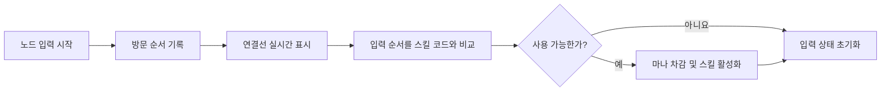

# InEarth4

Unity와 C#으로 제작한 모바일 조작 기반 액션 게임 프로젝트의 스크립트 보존 저장소입니다.
이 저장소는 2022년에 정리한 당시 코드의 스냅숏이며, 전체 Unity 프로젝트와 게임 리소스는 포함하지 않습니다.

## 개인 기여 바로 보기

[개인 기여 설명과 함수별 코드 확인 순서](./docs/PERSONAL_CONTRIBUTIONS.md)

| 대표 기능 | 개인 기여 범위 | 코드 바로 보기 |
| --- | --- | --- |
| 패턴 스킬 입력 | 아이디어 기획 및 입력 시스템 전체 구현 | [`입력 종료·스킬 판정`](https://github.com/fishbowl92/InEarth4/blob/1b3304b83aee43bfcb8a788b961bd5022c0453f2/PlayManager.cs#L1140-L1184) · [`노드 입력`](https://github.com/fishbowl92/InEarth4/blob/1b3304b83aee43bfcb8a788b961bd5022c0453f2/PlayManager.cs#L1014-L1119) |

팀 전체 코드와 개인 기여를 구분했습니다. 아래 프로젝트 코드 개요는 맥락 설명이며, 파일 전체를 단독 작성했다는 의미는 아닙니다.

## 프로젝트 개요

| 구분 | 내용 |
| --- | --- |
| 개발 형태 | 팀 프로젝트 |
| 사용 기술 | Unity, C# |
| 주요 영역 | 노드 연결형 패턴 스킬, 자동 이동 전투, 투사체와 버프·인벤토리 |
| 저장소 상태 | 당시 작성한 스크립트를 보존한 코드 자료 |

## 담당 및 기여 범위

- 휴대전화의 패턴 잠금 방식에서 착안한 스킬 입력 방식 기획
- 노드 연결형 패턴 입력 시스템 전체 구현
- 입력 연결선 표시, 스킬 판정, 마나 소비와 중복 적용 검사

패턴 입력 시스템은 아이디어 구상부터 게임 규칙과 코드 구현까지 직접 담당한 기능입니다.

## 프로젝트 코드 개요

### 1. 노드 연결형 패턴 스킬

사용자가 방문한 노드 번호를 순서대로 기록하고, 해당 순서를 보유 스킬의 패턴 코드와 비교합니다. 입력 중에는 연결선을 표시하며, 입력이 끝나면 스킬 존재 여부, 중복 적용 여부와 마나를 검사합니다.

관련 코드:

- [PlayManager.cs](./PlayManager.cs): 노드 입력, 연결선 표시, 스킬 검색과 사용 조건 검사
- [skillData.cs](./Scriptable/skillData.cs): 패턴 배열과 스킬 코드, 비용과 효과 데이터
- [LockNode.cs](./LockNode.cs): 입력 노드 식별자
- [GameManager.cs](./GameManager.cs): 보유 스킬의 패턴 미리보기

### 2. 투사체 상태와 재사용

활성 투사체와 사용이 끝난 투사체를 별도 목록으로 관리합니다. 재사용할 때는 기존 타격 목록을 초기화하고 피해량·사거리·속도·관통 횟수와 종료 지점을 다시 설정합니다. 투사체별 타격 목록으로 같은 적에게 중복 피해가 적용되는 것을 막습니다.

관련 코드:

- [BulletManager.cs](./BulletManager.cs)

### 3. 반복 생성 객체 재사용

투사체뿐 아니라 타격 효과, 골드와 인벤토리·옵션 UI에서도 비활성 객체를 찾아 다시 사용합니다. 공통 풀 관리자를 만든 구조는 아니며, 각 기능의 생명주기에 맞게 개별적으로 구현했습니다.

관련 코드:

- [PlayManager.cs](./PlayManager.cs): 적과 골드 관련 객체
- [StartManager.cs](./StartManager.cs): 인벤토리와 옵션 UI
- [GameManager.cs](./GameManager.cs): 패턴 미리보기 연결선

## 코드 안내 문서

- [핵심 코드 흐름](./docs/CODE_WALKTHROUGH.md)
- [현재 관점의 회고와 개선 방향](./docs/RETROSPECTIVE.md)

## 저장소 제한사항

- 전체 Unity 프로젝트가 아니므로 이 저장소만으로 게임을 실행할 수 없습니다.
- 원본 씬, 프리팹, 사운드와 이미지 등 일부 리소스가 포함되어 있지 않습니다.
- 당시 학습·개발 과정의 코드를 보존한 자료이므로 현재의 코드 작성 기준과 차이가 있습니다.
- 별도 라이선스를 제공하지 않으며, 공개 저장소는 오픈소스 사용 허가를 의미하지 않습니다.
