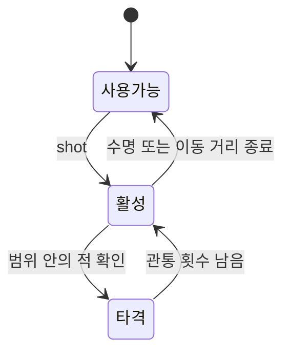

# InEarth4 핵심 코드 흐름

## 1. 패턴 스킬 데이터

[`skillData.cs`](../Scriptable/skillData.cs)는 스킬마다 다음 정보를 가집니다.

- `pattern`: 사용자가 연결해야 하는 노드 번호 배열
- `skillCode`: 노드 번호를 순서대로 결합한 비교 코드
- `cost`: 스킬 사용에 필요한 마나
- `duration`: 적용 시간
- `skillVal`, `skillEvent`: 스킬 수치와 실행 이벤트

`settingSkillCode`는 에디터에 입력한 `pattern` 배열을 스킬 판정에 사용할 문자열로 변환합니다.

## 2. 사용자 입력과 스킬 판정

중심 파일은 [`PlayManager.cs`](../PlayManager.cs)입니다.

### 입력 시작과 이동

1. `onMouseDownNode`가 입력을 시작하고 첫 노드를 연결합니다.
2. 이미 입력한 노드와 다른 노드에 진입하면 해당 식별자를 `visitedNode`에 추가합니다.
3. 입력 중에는 현재 노드에서 포인터 위치까지 연결선을 갱신합니다.
4. 확정된 노드 사이의 선은 별도 객체로 유지합니다.

### 입력 종료

1. 방문한 노드 번호를 순서대로 결합합니다.
2. 보유 스킬 목록에서 동일한 `skillCode`를 찾습니다.
3. 일치하는 스킬이 없으면 입력을 종료합니다.
4. 이미 적용된 스킬이면 중복 추가하지 않습니다.
5. 마나가 충분하면 비용을 차감하고 활성 버프 목록에 추가합니다.
6. 방문 노드와 연결선을 초기화합니다.

이 구현은 연속 좌표를 분석하는 일반적인 제스처 인식이 아니라, 미리 정의한 노드의 방문 순서를 게임 스킬과 연결하는 입력 시스템입니다.

## 3. 투사체 생명주기

[`BulletManager.cs`](../BulletManager.cs)는 투사체를 다음 상태로 관리합니다.

- `myBullets`: 현재 동작 중인 투사체
- `usedBullets`: 비활성화되어 다시 사용할 수 있는 투사체
- `Bullet.hit`: 해당 투사체가 이미 타격한 적

`shot`은 재사용 가능한 투사체가 있으면 타격 목록과 상태를 초기화하고, 없으면 새 객체를 생성합니다.
